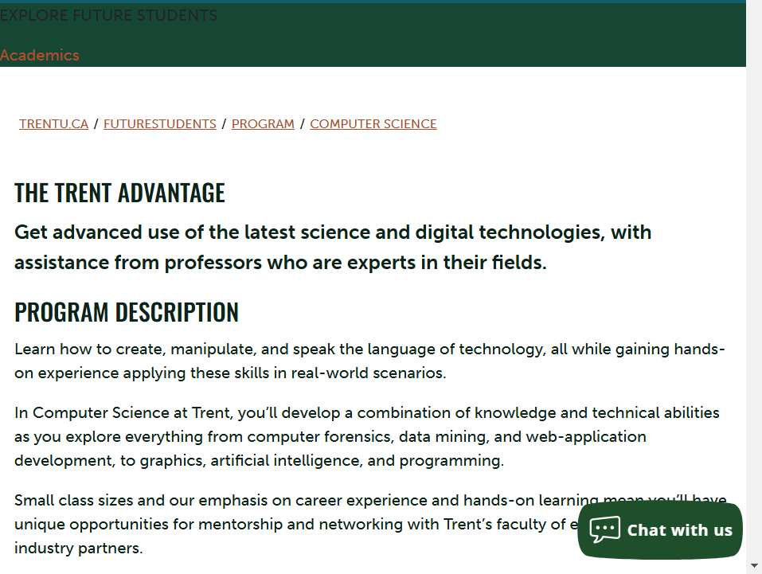

# workshop 4
By: Pratham Jadhav

# Emphasis 

Learn how to create, manipulate, and speak the language of technology, all while gaining hands-on experience applying these **skills in real-world scenarios**

## Strong

In Computer Science at Trent, you’ll develop a combination of knowledge and technical abilities as you explore **everything from computer forensics**, data mining, and web-application development, to graphics, artificial intelligence, and programming.
Small class sizes and our emphasis on **career experience and hands-on learning** mean you’ll have unique opportunities for mentorship and networking with Trent’s faculty of experts, as well as industry partners.

## Lists

## Unordered Lists

- List Item 1 
- List Item 2
  - Sub Item 1 
  - Sub Item 2
- List Item 3

## Oredered lists
 
 1. First Item
 2. second Item
    1. Sub Item One
    2. Sub Item Two
3. Third Item


## Images



## Hyperlinks

[COIS Department Website](https://www.trentu.ca/futurestudents/program/computer-science)

## Including Code

### Inline

In HTML the ``tag is used to display pictures.


### Code Fence

```html
 <meta charset="UTF-8">
  <meta name="viewport" content="width=device-width, initial-scale=1.0">
  <link rel="stylesheet" href="./styles/main.css">
  <title>About Me</title>
</head>
<body>
  <h1>John Smith</h1>

  <nav>
    <p>
      <a href="./portfolio.html">My portfolio</a> is available on this site,
      too!
    </p>
  </nav>
```

```css
 Pellentesque fermentum vitae lectus quis vestibulum. Donec tempus
        feugiat feugiat. Nam tortor felis, aliquet nec ligula a, commodo
        tincidunt turpis. In vitae consequat erat. Etiam tortor odio, lacinia
        nec enim at, euismod imperdiet sapien. Sed accumsan mauris lobortis
        ligula lobortis, nec condimentum ipsum tempus. Phasellus dictum ornare
        dapibus. Integer vitae mauris eu urna viverra vestibulum in ac orci.
        Proin et placerat ante. Aenean at pretium urna. Proin eleifend pretium
        est sit amet vestibulum.
      </p>
```

